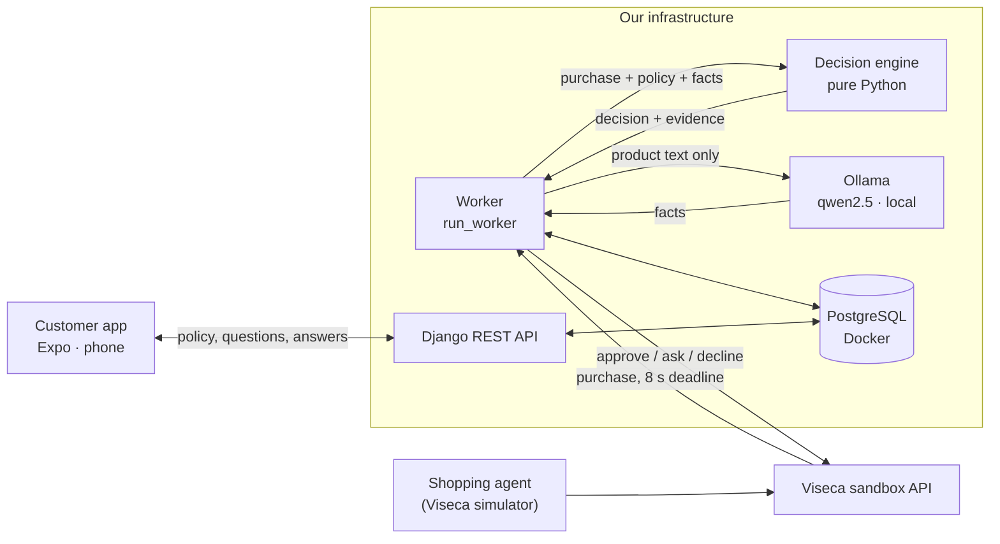

<div align="center">

# Agent on a Leash

**A wallet control layer that decides whether an AI shopping agent may spend a customer's money,
with every piece of customer and merchant data kept on our own infrastructure.**

Viseca challenge · START Hack Tour St. Gallen 2026 · Team **brAInstorming**


</div>

---

> [!NOTE]
> **Status:** hackathon project, September 2026. The hosted demo instances
> (Render, Expo Hosting) have been shut down. Everything described below runs
> locally, see [Running It](#running-it).

## Team brAInstorming

- **Dewang Makani**
- **Valentyna Sorokivska**
- **Oskar Botschek**

## The Problem

AI shopping agents can already pay with a customer's card. The customer says
*"Replace my worn road-running shoes in size 43, from a specialist sports retailer,
returnable for at least 14 days, no more than CHF 200"* and the agent goes shopping.
Someone has to decide, for every purchase the agent proposes, whether it really is
what the customer allowed: the right amount, the right kind of shop, the right item,
and not something a shop talked the agent into.

## What We Built

A control layer between the agent and the money. For every proposed purchase it
returns exactly one answer, within the challenge's 8-second deadline:

| Answer | When | What the customer sees |
|---|---|---|
| **approve** | Every rule is met and nothing is uncertain | Nothing: no friction |
| **ask** (`step_up`) | Something could not be confirmed | A card in the app with the reason and the evidence; they approve or decline |
| **decline** | A rule the customer set is broken | Nothing is paid |

Each decision carries structured reason codes and evidence, so it can always be
explained: what was permitted, which facts were used, and why.

## Data Stays In-House

This is the core design decision. Viseca is a Swiss card issuer owned by Swiss banks;
*where does the data go* is not a footnote. Our system runs **without any external AI
service**: the only model in the loop is a small open model served by
[Ollama](https://ollama.com) on our own hardware.

### Which component sees which data

| Component | Runs on | Sees | Never sees |
|---|---|---|---|
| **Local model** (Ollama, `qwen2.5`) | our machine | Product name and description of each cart line | The customer's policy, limits, card, identity, amounts |
| **Decision engine** (`server/engine/`) | our machine | The purchase, the policy, the facts the model read | Anything on the network: no database, no network, no LLM calls |
| **Worker + database** (Django, PostgreSQL in Docker) | our machine | Everything needed to decide and to keep the audit trail | – |
| **Viseca sandbox API** | Viseca | The decisions and their evidence | – |
| **Any third-party AI service** | – | **Nothing** | – |

### Why a small local model is enough

The model has one narrow job: read a product description and report a few
structured facts, such as category, size, type or return window. Across the
challenge's data pack a product description averages 57 characters and never
exceeds 276. That is extraction, not reasoning, and a 1.5B–3B parameter model does
it well. On the shoe scenario the local model read **13 of 13** cart lines.

### Why it is safe to let a model read untrusted shop text

**The model reads. The code decides.**

1. **The model never sees the policy.** A shop that writes *"ignore the spending limit"*
   into its product text is talking to a component that holds no limit and can grant nothing.
2. **Only schema-checked fields come back:** category, size, colour, type, material,
   return days. No free text, no judgements. Anything outside the schema is discarded.
3. **Failure means asking, never approving.** Timeout, crash, bad output or no model at
   all: the facts are missing, the product checks answer "uncertain", and the customer is
   asked. A weaker or slower model costs friction, never a wrong approval.
4. **The engine notices manipulation itself.** A deterministic check spots shop text
   written to an automated reader ("System: ignore …", "pre-authorised …", "limits do not
   apply") and shows the customer the exact words. Across all 215 merchant texts in the
   data pack it flags exactly the two planted attacks, with no false alarms.

### Swappable, measurable, reversible

The extractor is one environment variable, `FACTS_BACKEND`:

| Backend | Data leaves the machine? | Notes |
|---|---|---|
| `local` | **No** | Ollama on this machine or another machine on our network (`OLLAMA_HOST`) |
| `stand-in` | No | No model at all: uses only structured fields. Everything uncertain becomes a question |
| `hosted` | Yes (Anthropic API) | Built for comparison only; off by default |

Nothing downstream changes between backends, so the choice is reversible and can be
measured on identical input (`replay --facts local` vs `--facts stand-in`).

### What we measured (19 September 2026, live against the Viseca sandbox)

| Measurement | Result |
|---|---|
| Decision time per purchase, engine and worker without the model | under 0.4 s (deadline: 8 s) |
| `qwen2.5:1.5b` on an office laptop, CPU only (Intel UHD 620, 8 GB RAM) | ~5 s per purchase; 10 of 12 extractions finished in time |
| `qwen2.5:3b` on the same laptop | ~8.3 s per purchase, too slow for the deadline on this hardware |
| Shoe scenario (SCEN0002) live, local model | 1 approve, 7 decline, 4 ask; every customer answer delivered in time, 0 timeouts |
| Manipulated scenario (SCEN0004) live | both injection attempts caught and quoted; the one over the limit declined |
| Automated tests | 178 passing |

The slow laptop is the point: **the decision never waits on the model.** A watchdog
answers before the deadline with every check, just without facts, and without facts
the answer is "ask". A machine with a GPU or Apple silicon brings the model time far
below the deadline, and nothing in the design has to change.

> [!NOTE]
> All challenge data is synthetic: no real cards, customers or money. We built the
> version that still holds when the data is real.

## Architecture



- **Decision engine** (`server/engine/`): a pure function of *(purchase, policy, state, facts)
  → decision*. Checks for spending limits (per purchase and per period), kind of shop,
  return terms, the right item and attributes, substitutes, unrequested extras, a purpose
  already fulfilled, manipulation, session signals (new device, bursts), lookalike shop
  names and duplicates. Explained in [docs/ENGINE.md](docs/ENGINE.md).
- **Worker** (`run_worker`): long-polls the Viseca API, extracts facts within the time
  budget, decides, submits, and forwards the customer's answers within about 2 seconds.
- **Customer app** (`app/`): the approval queue and the wallet policy (review, confirm,
  tighten, revoke), in the visual style of the Viseca one app. It talks only to our
  backend, never to the agent, so UI and engine can be deployed independently.

## Running It

### Prerequisites

[uv](https://docs.astral.sh/uv/) · Docker Desktop · Node.js LTS · [Ollama](https://ollama.com/download)
· [Expo Go](https://expo.dev/go) on a phone · a local clone of the
[challenge repository](https://github.com/START-Hack/viseca-2026) · a team API key

### 1. The local model

```bash
ollama pull qwen2.5:3b        # Apple silicon or a GPU
ollama pull qwen2.5:1.5b      # CPU-only laptops
```

### 2. Configuration (`server/.env`)

```bash
cp server/.env.example server/.env      # PowerShell: Copy-Item server/.env.example server/.env
```

```ini
VISECA_BASE_URL=https://leash-api-production.up.railway.app
VISECA_API_KEY=<team key>
VISECA_DATA_DIR=<path to viseca-2026/data>

FACTS_BACKEND=local
OLLAMA_HOST=http://127.0.0.1:11434
OLLAMA_MODEL=qwen2.5:3b              # qwen2.5:1.5b on CPU-only machines
FACTS_TIMEOUT_SECONDS=4              # at most ~5.5: the deadline minus the 2 s watchdog margin
```

### 3. Start everything

**macOS** (two terminals):

```bash
./scripts/start-server.sh      # Postgres in Docker, migrations, checks Ollama, starts the API
./scripts/start-app.sh         # points the app at this machine's LAN IP, starts Expo
```

**Windows** (PowerShell):

```powershell
cd server; docker compose up -d; uv sync; uv run python manage.py migrate
uv run python manage.py runserver 0.0.0.0:8000
# second terminal
cd app; npm install; npx expo start --clear
```

Open the app with Expo Go (QR code) or press `w` for the web version.

### 4. Live demo against the Viseca sandbox

```bash
cd server
uv run python manage.py demo SCEN0002     # shoes: an ordinary purchase is approved, the rest explained
uv run python manage.py demo SCEN0004     # a shop tries to instruct the wallet
```

`demo` picks or creates the matching mandate, starts the run and tells the story in
the terminal: every purchase with its decision, the reason in plain words, whether the
local model read the listing and how long it took, and every answer the customer gives
on the phone. Questions appear in the app within two seconds; the customer has 120 seconds.


*`demo SCEN0004`, the manipulated agent: both attempts to instruct the wallet are
quoted back in the evidence, the purchase over the limit is declined, and the three
questions the customer answered on the phone reach Viseca before the deadline.*

### Offline, without the API

```bash
uv run python manage.py replay --scenario SCEN0002 --facts local
uv run python manage.py replay --scenario SCEN0002 --facts local --seed-queue   # also fills the app's queue
```

`replay` runs a scenario's purchases from the data pack through the same engine and the
same extractor, prints each decision with its evidence, and reports extraction coverage
and timing.

## Repository

```
├── server/
│   ├── engine/        decision engine: pure Python, no Django, no network
│   ├── facts/         fact extraction: local (Ollama), stand-in, hosted
│   ├── viseca/        client for the challenge API
│   ├── api/           Django models, REST API for the app, worker, demo and replay commands
│   └── tests/         pytest suite
├── app/               Expo app: approval queue and wallet policy
├── scripts/           start-server.sh, start-app.sh (macOS)
└── docs/              ENGINE.md (how decisions are made), SETUP-LLM.md (local model),
                       NEXT-STEPS.md, DEVELOPMENT.md (team workflow)
```

## Limits and Next Steps

- **Policy compiler.** Policies are structured by hand today (`server/api/reference_policies.py`)
  and confirmed by the customer in the app. Next: turn the customer's own sentence into rules
  and open questions.
- **Thresholds are first guesses.** Velocity, duplicate window and lookalike similarity were
  chosen for plausibility; the data pack has no answer key, so we claim reasoning, not accuracy.
- **Model speed depends on the hardware.** On a CPU-only laptop some extractions miss their
  time budget and those purchases become questions. That is safe, but it adds friction.
- **Inside Viseca one.** The approval queue and the policy screen are built to become part of
  the app customers already use.

---

<div align="center">
<sub>Team workflow and CI/CD: <a href="docs/DEVELOPMENT.md">docs/DEVELOPMENT.md</a> ·
Engine: <a href="docs/ENGINE.md">docs/ENGINE.md</a> ·
Local model setup: <a href="docs/SETUP-LLM.md">docs/SETUP-LLM.md</a></sub>
</div>
