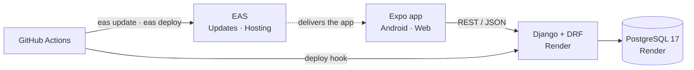
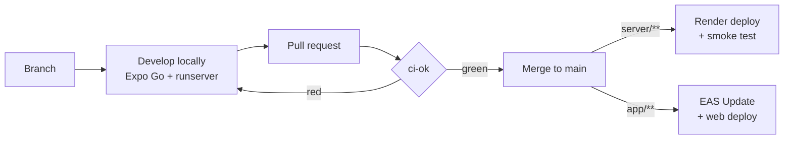

<div align="center">

# START Hack Tour St. Gallen 2026

**Hackathon prototype — Django REST API + Expo app, deployed on every merge.**

[](https://github.com/Oskar-567/2026_StartHackTourStGallen/actions/workflows/server-cd.yml)
[](https://github.com/Oskar-567/2026_StartHackTourStGallen/actions/workflows/app-cd.yml)


[**Web app**](https://123onetothree-hackathon.expo.app) ·
[**Android APK**](https://expo.dev/accounts/123onetothree/projects/hackathon/builds) ·
[**API**](https://hackathon-server-k39f.onrender.com/health/) ·
[**API docs**](https://hackathon-server-k39f.onrender.com/api/docs/)

</div>

---

## Tech Stack

| | Technology | Used for |
|---|---|---|
| **Server** | Python 3.13 · Django 6 · Django REST Framework | REST API in `server/` |
| | drf-spectacular | Swagger docs at `/api/docs/`, generated from the code |
| | PostgreSQL 17 | Docker locally, Render in production |
| | uv · pytest · ruff | Packages, tests, lint + formatting |
| **App** | Expo SDK 57 · React Native · TypeScript | One codebase for Android, iOS and web |
| | expo-router | File-based routing: every file in `app/src/app/` is a screen |
| | ESLint · `tsc` | Lint + typecheck |
| **Hosting** | Render (free) | Django server + Postgres, Frankfurt |
| | EAS (Expo Application Services) | OTA updates, Android builds, web hosting |
| **Automation** | GitHub Actions | CI on every PR, deploy on every merge to `main` |



## Repository Structure

```
├── server/                   Django project
│   ├── config/               settings.py (env-driven), urls.py
│   ├── api/                  views.py (endpoints); add models.py / serializers.py here
│   └── tests/                pytest tests (fixture: api_client)
├── app/                      Expo app
│   └── src/
│       ├── app/              screens (file-based routes), _layout.tsx
│       └── services/api.ts   ALL HTTP calls to the server
├── .github/workflows/        ci.yml · server-cd.yml · app-cd.yml
├── render.yaml               Render infrastructure (server + database)
└── CLAUDE.md                 instructions for Claude Code
```

## Quick Start

> [!NOTE]
> **Prerequisites:** Git · [uv](https://docs.astral.sh/uv/) · Node.js LTS · Docker Desktop · [GitHub CLI](https://cli.github.com/) (optional) · [Expo Go](https://expo.dev/go) on your phone

One-time setup:

```powershell
git clone https://github.com/Oskar-567/2026_StartHackTourStGallen.git
cd 2026_StartHackTourStGallen

# Server
cd server
Copy-Item .env.example .env
docker compose up -d
uv sync
uv run python manage.py migrate
cd ..

# App
cd app
Copy-Item .env.example .env   # set EXPO_PUBLIC_API_URL to your LAN IP (ipconfig → IPv4 address)
npm install
cd ..
```

Then start both as described in [Start Developing](#1-start-developing). The start screen should show **API: ok** and **Database: ok**.

## Hackathon Workflow



> [!IMPORTANT]
> `main` is protected and **everything merged to `main` goes live automatically**. Every change goes through a pull request with a green `ci-ok` check.

### 1. Start Developing

```powershell
git switch main
git pull
git switch -c feat/short-description     # or fix/..., docs/...
```

<table>
<tr><th>Terminal 1 — server</th><th>Terminal 2 — app</th></tr>
<tr>
<td>

```powershell
cd server
docker compose up -d
uv sync
uv run python manage.py migrate
uv run python manage.py runserver 0.0.0.0:8000
```

</td>
<td>

```powershell
cd app
npm install
npx expo start
# scan QR with Expo Go, press w for web
```

</td>
</tr>
</table>

`uv sync`, `migrate` and `npm install` only matter after someone added dependencies or migrations, but they are fast, so just run them.

| Local | URL |
|---|---|
| API docs | http://localhost:8000/api/docs/ |
| Admin | http://localhost:8000/admin/ — create a login with `uv run python manage.py createsuperuser` |

### 2. Build a Feature

1. **Model** — add it to `server/api/models.py`, then `uv run python manage.py makemigrations` + `migrate`.
2. **Endpoint** — serializer + view in `server/api/`, route in `server/config/urls.py`. It shows up in `/api/docs/` automatically.
3. **Test** — add a test in `server/tests/`, run `uv run pytest`.
4. **App** — add a typed function to `app/src/services/api.ts`, use it in a screen under `app/src/app/`.
5. **Try it** — on your phone and on web (`w`).

> [!TIP]
> Agree on the endpoint (URL + JSON shape) first — then server and app can be built in parallel by different people.

### 3. Check, Commit, Open a Pull Request

<table>
<tr><th>Server checks (<code>server/</code>)</th><th>App checks (<code>app/</code>)</th></tr>
<tr>
<td>

```powershell
uv run ruff format .
uv run ruff check --fix .
uv run pytest
```

</td>
<td>

```powershell
npm run lint
npx tsc --noEmit
```

</td>
</tr>
</table>

```powershell
git add <files>
git commit -m "feat: short description"
git push -u origin HEAD
gh pr create --fill --base main
gh pr checks --watch                     # wait for ci-ok
gh pr merge --squash --delete-branch     # merge when green
```

Without `gh`: open the PR on github.com and use **Squash and merge**.

### 4. After the Merge

| Changed | What happens | Where to watch |
|---|---|---|
| `server/**` | tests → Render deploy → smoke test (≈ 3–5 min) | Actions → **Server CD** |
| `app/**` | OTA update + web deploy (≈ 3–5 min) | Actions → **App CD** |

The Android app picks up an update after closing and reopening it **twice**. Then start again at [step 1](#1-start-developing).

<details>
<summary><b>Keeping your branch up to date & resolving conflicts</b></summary>

```powershell
git fetch origin
git merge origin/main
```

| Conflict in | Fix |
|---|---|
| `server/uv.lock` | take either version, then `uv lock` |
| `app/package-lock.json` | take either version, then `npm install` |
| two migrations with the same number | `uv run python manage.py makemigrations --merge` |

</details>

<details>
<summary><b>Command cheat sheet</b></summary>

| Task | Command | In |
|---|---|---|
| Add a Python dependency | `uv add <package>` | `server/` |
| Add an app library | `npx expo install <package>` — never plain `npm install <package>` | `app/` |
| Run one test file | `uv run pytest tests/test_health.py -v` | `server/` |
| Reset the local database | `docker compose down -v; docker compose up -d; uv run python manage.py migrate` | `server/` |
| Restart Expo with empty cache | `npx expo start --clear` | `app/` |
| Phone on a different network | `npx expo start --tunnel` | `app/` |
| Status of your PR | `gh pr checks` | any |
| Latest deploy runs | `gh run list --branch main --limit 5` | any |

</details>

## Rules That Avoid Trouble

> [!WARNING]
> - **Never commit `.env` files.** Configuration only via environment variables: new server variables go into `server/.env.example` + `render.yaml`, new app variables into `app/.env.example`. Tell the repo owner, who sets the production values.
> - **Only libraries that run in Expo Go**, installed with `npx expo install`. Custom native code or changes to `app/app.json` need a new APK build (15/month) — ask the repo owner first.

- All HTTP calls go through `app/src/services/api.ts`.
- No files on the server disk (Render wipes it on every deploy), no background workers.

<details>
<summary><b>Troubleshooting</b></summary>

| Problem | Fix |
|---|---|
| App shows `Network request failed` | Check the LAN IP in `app/.env`, restart `npx expo start`, phone on the same Wi-Fi, allow Python through the Windows firewall |
| App still uses an old API URL | `npx expo start --clear` |
| `connection refused` on port 5433 | Start Docker Desktop, then `docker compose up -d` |
| Expo Go says the project is incompatible | Update Expo Go (the project uses SDK 57) |
| CI fails on `ruff format --check` | `uv run ruff format .` and commit |
| Production API is slow on the first request | The free Render server was asleep — it wakes up within ~1 min |

</details>

<details>
<summary><b>Free tier limits</b></summary>

- **Render web service** sleeps after 15 min without traffic; waking up takes ~1 min. Open `/health/` shortly before a demo.
- **Render Postgres (free)** expires 30 days after creation. No backups — do not rely on production data.
- **EAS**: 15 Android builds/month, 100k web requests/month.

</details>

---

<div align="center">
<sub>More details: <a href="server/README.md">server/README.md</a> · <a href="app/README.md">app/README.md</a> · Working with Claude Code: <a href="CLAUDE.md">CLAUDE.md</a></sub>
</div>
