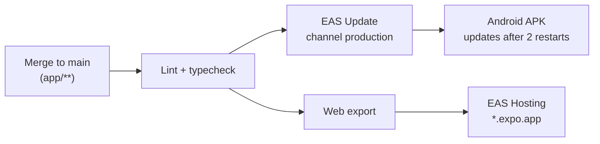

<div align="center">

# App

**Expo app for Android, iOS and web — delivered via EAS.**


[← Back to main README](../README.md)

</div>

---

## Local Development

```powershell
Copy-Item .env.example .env   # first time only: EXPO_PUBLIC_API_URL=http://<your LAN IP>:8000
npm install
npx expo start                # scan the QR code with Expo Go, press w for web
```

> [!TIP]
> - Restart `npx expo start` after changing `.env` (add `--clear` if the old value sticks).
> - Phone on a different network: `npx expo start --tunnel`.
> - Check the web version (`w`) regularly — native-only libraries can break on web.

> [!WARNING]
> - Only use libraries that work in **Expo Go**, and install them with `npx expo install <package>` (picks compatible versions).
> - Do not keep an `.env.local` file: it overrides `.env` and points your app at production.

## Project Layout

```
app/src/
├── app/                screens — every file is a route (expo-router)
│   ├── _layout.tsx     root Stack navigator
│   └── index.tsx       start screen (server health check)
└── services/
    └── api.ts          ALL HTTP calls: request<T>(), ApiError, typed endpoint functions
```

Adding an endpoint call:

```ts
// src/services/api.ts
export type Item = { id: number; name: string };

export async function fetchItems(): Promise<Item[]> {
  return request<Item[]>("/api/items/");
}
```

Every screen handles **loading**, **error** and **success** — the production server can take up to a minute to wake up.

## Checks

```powershell
npm run lint
npx tsc --noEmit
```

## Deployment



Workflow: `.github/workflows/app-cd.yml`.

| What | Command | When |
|---|---|---|
| Change production API URL | `eas env:update --variable-name EXPO_PUBLIC_API_URL --value <url> --environment production` | server URL changed |
| New Android APK | `eas build --profile preview --platform android` | new native library or `app.json` change (15 builds/month) |

<details>
<summary><b>Manual web deploy from your machine</b> (normally CI does this)</summary>

```powershell
eas env:pull --environment production
npx expo export --platform web --clear
eas deploy --prod
Remove-Item .env.local
```

`--clear` is required: otherwise Metro reuses cached bundles with the LAN IP from `.env`.

</details>
