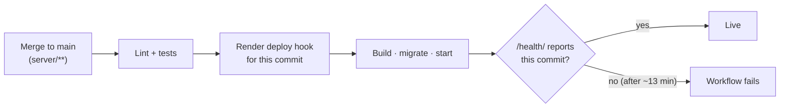

<div align="center">

# Server

**Django REST API — managed with uv, deployed to Render.**


[**Production API docs**](https://hackathon-server-k39f.onrender.com/api/docs/) ·
[**Health**](https://hackathon-server-k39f.onrender.com/health/) ·
[← Back to main README](../README.md)

</div>

---

## Local Development

```powershell
Copy-Item .env.example .env                       # first time only
docker compose up -d                              # Postgres 17 on localhost:5433
uv sync
uv run python manage.py migrate
uv run python manage.py runserver 0.0.0.0:8000    # 0.0.0.0 so phones on your Wi-Fi can connect
```

| | URL |
|---|---|
| Health | http://localhost:8000/health/ |
| API docs (Swagger) | http://localhost:8000/api/docs/ |
| OpenAPI schema | http://localhost:8000/api/schema/ |
| Admin | http://localhost:8000/admin/ — `uv run python manage.py createsuperuser` |

> [!NOTE]
> Tests need the Docker Postgres running (`docker compose up -d`).

## Common Commands

| Task | Command |
|---|---|
| Run tests | `uv run pytest` |
| Run one test | `uv run pytest tests/test_health.py -k <name> -v` |
| Lint | `uv run ruff check --fix .` |
| Format | `uv run ruff format .` |
| Add a dependency | `uv add <package>` (dev tools: `uv add --dev <package>`) |
| New migrations | `uv run python manage.py makemigrations` |
| Merge conflicting migrations | `uv run python manage.py makemigrations --merge` |
| Reset local database | `docker compose down -v; docker compose up -d; uv run python manage.py migrate` |

## Project Layout

```
server/
├── config/
│   ├── settings.py     all settings from environment variables
│   └── urls.py         routes: /admin/, /health/, /api/schema/, /api/docs/
├── api/
│   └── views.py        endpoints (add models.py, serializers.py, admin.py as needed)
└── tests/
    ├── conftest.py     api_client fixture
    └── test_*.py
```

## Configuration

All settings come from environment variables — locally from `server/.env`, in production from Render.

| Variable | Local (`.env.example`) | Production |
|---|---|---|
| `DEBUG` | `True` | `False` |
| `SECRET_KEY` | dev-only value | generated by Render |
| `DATABASE_URL` | Docker Postgres on port 5433 | Render Postgres |
| `ALLOWED_HOSTS` | `*` | Render hostname (automatic) |
| `CORS_ALLOWED_ORIGINS` | `http://localhost:8081` | web app origin, set in the Render dashboard |

> [!IMPORTANT]
> When adding a variable, add it to **`.env.example`** and **`render.yaml`** (`envVars`, secrets with `sync: false`) — and tell the repo owner to set the production value.

## Deployment



Workflow: `.github/workflows/server-cd.yml`. Migrations run automatically on every start.

<details>
<summary><b>One-time setup (already done)</b></summary>

- Render Blueprint from `render.yaml` creates `hackathon-server` and `hackathon-db`.
- GitHub Actions secret `RENDER_DEPLOY_HOOK_URL` (Render → `hackathon-server` → Settings → Deploy Hook) and variable `SERVER_URL` (service URL without trailing slash). Without `SERVER_URL` the deploy job is skipped.
- `CORS_ALLOWED_ORIGINS` is set in the Render dashboard (not in `render.yaml`) to the web app origin, without a trailing slash.

</details>
